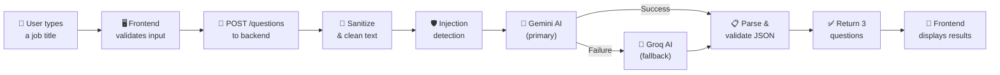

<div align="center">
  
  <h1>MeloTech</h1>
  <p>An AI-powered HRTech tool that generates thoughtful, role-specific interview questions from a job title.</p>
  <br />
  <p>
    <strong>Frontend:</strong> React · TypeScript · Tailwind CSS &nbsp;|&nbsp;
    <strong>Backend:</strong> FastAPI · Pydantic &nbsp;|&nbsp;
    <strong>AI:</strong> Google Gemini · Groq (LLaMA)
  </p>
  <br />
  <p>
    <a href="https://melotech.vercel.app/"><strong>🌐 Live App</strong></a> &nbsp;·&nbsp;
    <a href="https://melotechapi.onrender.com/docs"><strong>📡 API Docs</strong></a>
  </p>
</div>

---

## What MeloTech Does

MeloTech solves a specific, common problem: **coming up with good interview questions**.

You type in a job title — like "Customer Success Manager" or "Senior Backend Engineer" — and MeloTech instantly generates **3 high-quality, role-specific interview questions**. Each question comes with a brief "Why it matters" explanation that tells the interviewer exactly what they will learn from the candidate's answer.

The questions are not generic. They are tailored to the role, aware of seniority level, and balanced across behavioral, situational, and technical dimensions. They are designed to feel like they were written by an experienced hiring manager at a serious startup.

---

## How It Works

The application is split into two independent parts: a **React frontend** and a **FastAPI backend**. Here is the full flow from the moment a user types a job title to the moment they see their questions:



### Step by step

1. **User types a job title** in the frontend input field (e.g. "Product Manager").
2. **Frontend validates the input** — checks length, blocks empty submissions, and strips obviously suspicious content before anything leaves the browser.
3. **Frontend sends a POST request** to the backend's `/questions` endpoint with the job title in a JSON body.
4. **Backend sanitizes the text** — strips whitespace, removes invisible control characters, collapses internal spacing, and enforces a hard character limit.
5. **Backend checks for prompt injection** — 20+ regex patterns scan the input for instruction-override attempts, role impersonation, prompt leaking, and code injection. If any pattern matches, the request is rejected with a clear error.
6. **Backend calls Google Gemini** (the primary AI model) with a carefully crafted system prompt and the sanitized job title.
7. **If Gemini fails** for any reason (network error, rate limit, malformed output), the backend automatically **falls back to Groq** (LLaMA 3.3 70B) using the exact same prompt. The user never sees the failover.
8. **Backend parses the AI response** — strips markdown code fences, validates the JSON structure, confirms exactly 3 questions exist, and validates each question against a strict schema.
9. **Backend returns the structured response** to the frontend as clean JSON.
10. **Frontend displays the 3 questions** in a responsive grid, each with its category badge and "Why it matters" explanation.

---

## Why These AI Models?

MeloTech uses a **primary + fallback** architecture to maximize reliability:

| Model | Role | Why |
|-------|------|-----|
| **Google Gemini 3.1 Pro Preview** | Primary | Highly capable at structured JSON output, excellent instruction following, strong reasoning for role-specific question generation. Pro is chosen for its depth of reasoning — interview questions benefit from a model that understands role nuance. |
| **Groq LLaMA 3.3 70B** | Fallback | Extremely fast inference (Groq's custom hardware), strong open-source model, reliable JSON output. Used only when Gemini is unavailable, ensuring the user always gets a result. |

The fallback is not a downgrade — it is a different provider entirely. If Google's API is down, Groq (running on completely separate infrastructure) is almost certainly still up. This gives MeloTech near-100% availability without adding complexity.

Both models use a **temperature of 0.7** — a deliberate choice that balances variety (different questions each time you run the same title) with reliability (the model stays disciplined enough to output valid JSON consistently).

---

## The System Prompt

The system prompt is the core of MeloTech's intelligence. It lives in `backend/app/services/prompt_builder.py` and is never exposed to the frontend or the user.

### What makes it effective

**Role-specific depth.** The prompt instructs the AI to adapt its questions based on the role family:
- Engineering roles get questions about debugging, architecture, and tradeoffs.
- Customer-facing roles get questions about churn, escalation handling, and empathy.
- Product roles get questions about prioritization, metrics, and decision-making.
- Leadership roles get questions about alignment, delegation, and systems thinking.

**Seniority awareness.** If the job title contains words like "Senior," "Staff," "Lead," "Director," or "VP," the AI raises the depth of its questions — asking about system thinking, ownership, cross-functional coordination, and handling ambiguity. For junior roles, it focuses on fundamentals, learning ability, and practical judgment. It never makes questions too easy or too academic.

**Behavioral and technical balance.** Every set of 3 questions is required to cover different angles:
- At least one question probes behavioral judgment.
- At least one question probes situational reasoning.
- At least one question probes role-specific depth (technical, strategic, or operational).

**Concise and insightful output.** Each question is limited to 1–2 sentences. Each "why it matters" explanation is limited to 1–2 sentences. No fluff, no clichés, no generic filler like "Tell me about yourself."

**Injection-resistant.** The prompt explicitly tells the AI to treat the user-provided job title as untrusted input. Even if an attacker passes malicious instructions through the job title field, the AI is instructed to ignore those parts and still produce safe, role-appropriate questions.

---

## Security

MeloTech takes a defense-in-depth approach to security:

### Frontend protections
- Input length is capped before the request is sent.
- The API URL is loaded from environment variables — nothing is hardcoded.
- The frontend never contains API keys, system prompts, or backend logic.

### Backend protections
- **Input sanitization:** Strips control characters, collapses whitespace, enforces a hard length cap.
- **Prompt injection detection:** 20+ regex patterns organized into 5 categories (instruction override, role impersonation, prompt leaking, instruction injection, code injection). Suspicious input is rejected with a `400` error before it ever reaches an AI model.
- **System prompt isolation:** The user's job title is placed only in the user message — never inside the system instruction. This is the most important architectural decision for preventing prompt injection.
- **AI response validation:** The backend never trusts the AI's output. It parses the JSON, validates the structure, confirms exactly 3 questions, and validates each question against a Pydantic schema. Malformed output triggers the fallback provider.
- **Global error handler:** No stack trace, no internal details, and no secrets are ever leaked to the client. Every unhandled exception returns a generic `500` error with a safe message.
- **No secrets in client code:** API keys for Gemini and Groq live only in the backend's `.env` file.

---

## Startup Validation

When the backend starts, it immediately checks that all required environment variables are properly configured:

- It verifies that `GEMINI_API_KEY` and `GROQ_API_KEY` are present and not still set to placeholder values from `.env.example`.
- It checks that `CORS_ORIGINS` is set so the frontend can communicate with the backend.
- Each issue is logged as a **warning** with a clear, human-readable message.
- If **both** AI provider keys are missing, the server **refuses to start** — because a backend that can't generate questions is a broken backend.

This means you will never deploy a misconfigured server and discover the problem only when a user hits an error. The server tells you immediately.

---

## Tests

The backend includes **9 automated tests** covering every critical path:

| Test | What it verifies |
|------|-----------------|
| `test_health_returns_ok` | The `/health` endpoint returns `{"status": "ok"}`. |
| `test_root_returns_status` | The root `/` endpoint returns application info. |
| `test_valid_job_title_returns_questions` | A valid job title returns exactly 3 questions with `category`, `question`, and `why_it_matters` fields. |
| `test_empty_job_title_returns_400` | An empty string is rejected by Pydantic validation (422). |
| `test_whitespace_only_job_title_returns_400` | Whitespace-only input passes Pydantic but is caught by the sanitization layer (400). |
| `test_prompt_injection_returns_400` | Input containing injection patterns like "ignore previous instructions" is blocked (400). |
| `test_gemini_fails_groq_succeeds` | When Gemini throws an exception, Groq is called and returns valid questions (200). |
| `test_both_providers_fail_returns_503` | When both providers fail, the backend returns a 503 with a clear error message. |
| `test_malformed_ai_response_triggers_fallback` | When Gemini returns garbage text instead of JSON, the backend falls back to Groq. |

All AI calls are mocked in tests — no real API keys are needed to run the test suite.

Run them with:
```bash
cd backend
source venv/bin/activate
python -m pytest tests/ -v
```

---

## Project Structure

```
melotech/
├── frontend/                          # React + TypeScript + Tailwind CSS
│   ├── public/
│   │   └── favicon.png                # MeloTech logo (also used as favicon)
│   ├── src/
│   │   ├── App.tsx                    # Main application component (UI, state, form logic)
│   │   ├── api.ts                     # API client (fetches questions from the backend)
│   │   ├── index.css                  # Global styles and Tailwind configuration
│   │   └── main.tsx                   # React entry point
│   ├── .env.example                   # Template for environment variables
│   ├── index.html                     # HTML shell with meta tags and favicon
│   ├── package.json                   # Dependencies and scripts
│   ├── vite.config.ts                 # Vite build configuration
│   └── README.md                      # Frontend-specific setup instructions
│
├── backend/                           # FastAPI + Pydantic + Python
│   ├── app/
│   │   ├── main.py                    # App factory, CORS, startup validation, global error handler
│   │   ├── core/
│   │   │   ├── config.py              # Environment variable loading (cached with lru_cache)
│   │   │   ├── logging.py             # Centralized logger setup
│   │   │   └── security.py            # Prompt injection detection (20+ regex patterns)
│   │   ├── schemas/
│   │   │   ├── common.py              # ErrorResponse model (consistent error shape)
│   │   │   └── questions.py           # QuestionRequest, QuestionItem, QuestionsResponse
│   │   ├── services/
│   │   │   ├── sanitization.py        # Input cleaning (strip, control chars, whitespace, length)
│   │   │   ├── prompt_builder.py      # System prompt construction (never includes user text)
│   │   │   ├── gemini_client.py       # Google Gemini SDK wrapper (async via thread pool)
│   │   │   ├── groq_client.py         # Groq SDK wrapper (async via thread pool)
│   │   │   ├── response_parser.py     # AI response → validated JSON (strips fences, validates)
│   │   │   └── ai_orchestrator.py     # Gemini → Groq fallback logic
│   │   └── routes/
│   │       ├── health.py              # GET /health
│   │       └── questions.py           # POST /questions (the core endpoint)
│   ├── tests/
│   │   ├── test_health.py             # Health and root endpoint tests
│   │   └── test_questions.py          # Full question generation pipeline tests
│   ├── .env.example                   # Template for backend environment variables
│   ├── requirements.txt               # Python dependencies
│   └── README.md                      # Backend-specific setup instructions
│
└── README.md                          # This file — full project overview
```

---

## Live Deployment

MeloTech is deployed and available to use right now:

| Part | URL |
|------|-----|
| **Frontend** | [melotech.vercel.app](https://melotech.vercel.app/) |
| **Backend API** | [melotechapi.onrender.com](https://melotechapi.onrender.com/) |
| **API Docs (Swagger)** | [melotechapi.onrender.com/docs](https://melotechapi.onrender.com/docs) |

> **Note:** The backend is hosted on Render's free tier, so the first request after a period of inactivity may take a few seconds while the server wakes up.

---

## Local Setup

If you want to run the project locally instead, each part has its own README with step-by-step setup instructions:

| Part | Setup guide |
|------|------------|
| **Frontend** (React) | See [`frontend/README.md`](./frontend/README.md) |
| **Backend** (FastAPI) | See [`backend/README.md`](./backend/README.md) |

**Quick version:**

1. Start the backend first (`cd backend` → install deps → add API keys to `.env` → `fastapi dev app/main.py`).
2. Then start the frontend (`cd frontend` → `npm install` → `npm run dev`).
3. Open `http://localhost:5173` in your browser.

---

## Design Philosophy

MeloTech is intentionally small. It does one thing — generate interview questions — and does it well. There is no authentication, no database, no background workers, no analytics, no multi-tenant logic. Every line of code exists to serve the core feature.

The codebase is designed to be:

- **Readable** — Every file, function, and non-obvious line has a comment or docstring explaining what it does and why.
- **Secure** — Input is sanitized, injection is detected, AI output is validated, secrets are isolated, and errors never leak internals.
- **Resilient** — If the primary AI provider fails, the fallback takes over transparently. If both fail, the user gets a clear, human-readable error — never a stack trace.
- **Auditable** — The code can be read top-to-bottom by a reviewer unfamiliar with the project. There are no hidden dependencies, no magic, and no clever tricks.

---

<div align="center">
  <sub>Built with care for the Melo Associates technical assessment.</sub>
</div>
